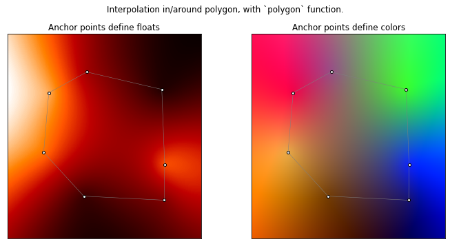
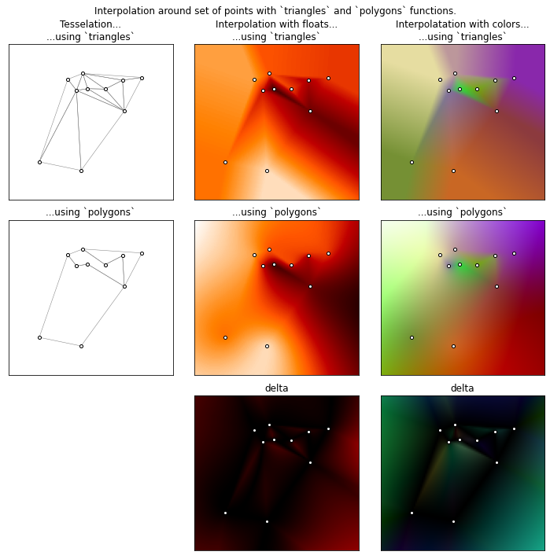
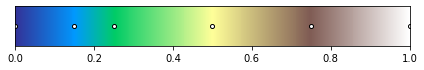
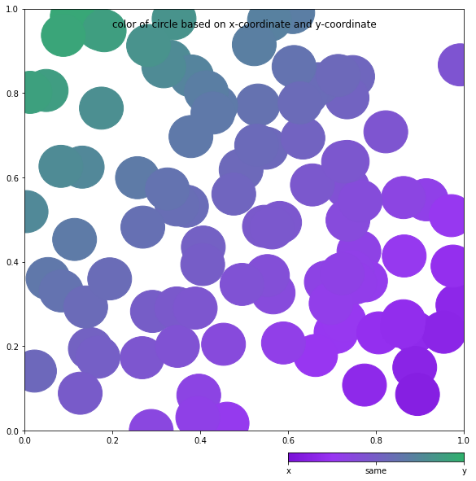
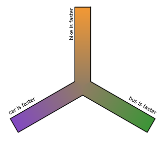
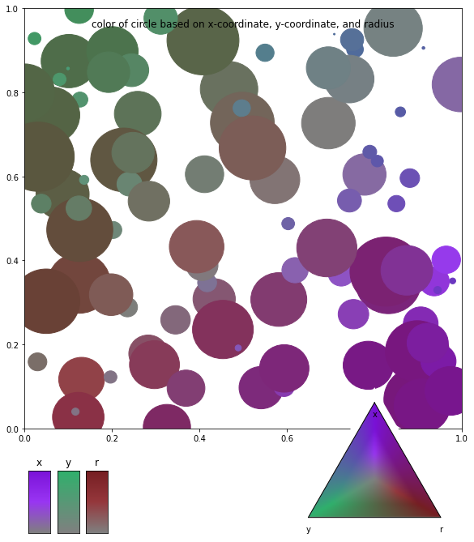

# interpol

Package with interpolation functions

* Functions for interpolation in/around a polygon and in the plane.
* Generalised color maps which accept >1 input value.

In all code samples, the line module `point2color` is assumed to be imported `as p2c`.

## Interpolation in the plane

### Interpolation in/around a single polygon: `polygon`

Interpolate the value in the 2D-plane, when the values at a nodes of a closed polygon are provided. 

Sample use:
```python
# %% Sample use of interpolation function in/around single polygon.

anchors = [[0,0], [1,0], [1,1], [0,1]]

# Interpolation with numeric values.
values = [1, 5, 0, 2]
f = p2c.polygon(anchors, values)
f((0.5, 0.6)) #1.8

# Interpolation with colors.
values = [to_rgba('w'), to_rgba('r'), to_rgba('g'), to_rgba('c')]
f = p2c.polygon(anchors, values)
f((0.5, 0.6)) #array([0.4  , 0.575, 0.425, 1.   ])
```

Here an illustration that shows how the interpolated values/colors vary across the plane for a given polygon. The anchor points are indicated.


### Interpolation around a set of points: `triangles` and `polygons`

Interpolate the value in the 2D-plane, when the values at several points are provided. There are 2 functions for this:

* `triangles` tesselates the plane with triangles based on the provided anchorpoints, and does 'standard' barycentric interpolation within each triangle. Disadvantage: a maximum of 3 anchors is used for any point, which does not always look good. Also, extrapolation, i.e. to points that do not lay within the convex hull around the anchorpoints, is not possible. If wanted, the function tries nonetheless, but results are often poor.
* `polygons` is a more general function, that gives better results. It divides the plane into *polygons* and does interpolation inside of them, based on the algorithm described in [this great article](https://cgvr.cs.uni-bremen.de/papers/barycentric/barycentric.pdf)

Though it's not perfect, `polygon` generally gives much smoother results, as can be seen in the illustration below.

Sample use:
```python
# %% Sample use of interpolation functions in/around set of points.

anchors = np.random.rand(10, 2) #random points in plane

# Interpolation with numeric values.
values = np.random.rand(10) #random value for each point
# using triangles
f = p2c.triangles(anchors, values)
f((0.5, 0.6)) #0.69...
# using polygons
f = p2c.polygons(anchors, values)
f((0.5, 0.6)) #0.71...

# Interpolation with colors: analogously
```

Here an illustration that shows how the interpolated values/colors vary across the plane. It also shows how both functions tesselate the plane in the first graph of each row. Note how the interpolations on the second row (using `polygons`), are smoother than those on the first (using `triangles`).



## Colormaps
The interpolation functions above can be used for colormaps with 3 axes. For a better understanding, we go into colormaps with 1 and 2 axes first, even though these don't use the interpolation functions.

### With 1 axis
A common colormap turns any value in the interval [0, 1] into its corresponding color, for example the 'terrain' colormap in matplotlib: 



Here the values for which a color has been explicitly specified (the anchor points), are marked with dots. The color for any other value is interpolated from the nearest on either side).

If the values that we want to turn into colors don't live on the interval [0, 1], some mapping of the input domain onto [0, 1] is necessary, but this is left out of consideration here.

### With 2 axes: `ColorMap2`
If we have a 'diverging' colormap, like the red-green one below, we can see this as a special case of the 1-axis colormap we just saw. But we can also imagine that there are in fact 2 axes (A on the left and B on the right), that meet in the middle. If values for *a* and *b*, both in the interval [0, 1], are provided, we are able to pick a single color on the bar. We do this by taking difference d = b - a. If b is the larger value, we have d > 0, and the color that belongs to this point (a, b) is the color that we find on axis B at the value d. If a is the larger value, we have d < 0, and the corresponding color is found on axis A at the value -d. 

An example would be when a is my expenditure in a given time period, and b is my income in the same time period. The resulting diverging colormap shows the 'income balance':


(Anchor points are again indicated; here, 2 colors were used on axis A, 3 on axis B, and also the center color was specified.)

It might seem a bit silly to turn what is basically a single variable (*d*) into two variables (*a* and *b*), especially since our color map is really only 1-dimensional. However, this will help us generalise onto three axes, further below. 

It's important that we see that this color map actually displays the *relative size* of *a* and *b*:
* It shows us, *which is the largest* of the 2 values, from the principle color (red or green) - if *a* is larger, the color comes from axis A. 
* It shows us, *how much larger* the largest of the two values is - the further the color is towards the end of the axis, the larger their difference.

Note that this is only possible if the values have the same unit and can be meaningfully subtracted from each other. 

Another example might be the time gained by switching between driving and biking to a certain location. Either biking (left) or driving (right) is faster, and the larger the time difference between the two transport options, the further away from the center the color is picked:


Using this final example, we see that one of the values (*a*, *b*) is always 0. That's because we are showing the 'time gained'. The slowest of the 2 options becomes the reference for the other one, i.e., (*a*, *b*) = (something, 0) if the car is the slowest option, which translates to a color from the left side of the color map. Vice versa, when biking is slower, its 'time gained' is 0, so (*a*, *b*) = (0, something). 

Note that this means that the color that corresponds to (bike takes 4 minutes, car takes 7 minutes) is the same as the one that corresponds to (bike takes 5 minutes, car takes 8 minutes), which underlines that this colormap can be used to show *relative size*: the gain by going by bike is 3 minutes in both cases.

The color mapping function to find the color of a point (*a*, *b*), is included in the `ColorMap2` class. The arguments to initialize this class are the colors on either axis. It's possible to include arguments that handle the mapping of the input domain, in (the likely) case the extremes on the axes do *not* correspond to a difference between *a* and *b* of exactly 1.

`ColorMap2` objects contain the method `.color` to get the color of the point (*a*, *b*), as well as the method `.colorbar` to plot the legend.

Sample usage:
```python
# %% Sample use of ColorMap2, short

cmap = p2c.ColorMap2(['#D87A11', '#F39935'], ['#6C2FB1'])
cmap.color(0.2, 0.5) #(0.6699, 0.3778, 0.4678, 1.0) (includes alpha)
```

Or, more elaborate:
```python
# %% Sample use of ColorMap2, longer

# Set-up canvas
fig = plt.figure(figsize=(7.5, 9))
ax = fig.add_axes([0, 0.2, 1, 0.8])
cax = fig.add_axes([0.6, 0, 0.4, 0.3])
fig.suptitle('color of circle based on x-coordinate and y-coordinate')

# Set-up colormap
cmap = p2c.ColorMap2(['#7A11D8', '#9935F3'], ['#2FB16C'])

# Add sample data
for i in range(100):
    a, b = rnd.rand(2)
    col = cmap.color(a, b) #this is where the magic happens
    circle = plt.Circle((a, b), 0.05, color=col)
    ax.add_artist(circle)
    
# Add legends
cmap.colorbar(cax)
cax.set_ticks([(1,0), (0,0), (0,1)], '')
cax.set_ticklabels(['x', 'same', 'y'])
```



## With 3 axes: `ColorMap3`
Now, what if we have another transport mode in the example of the previous section? What if we also have the option of taking public transport, and want to be able to pick a color, based on the differences in time needed to get somewhere by bike, car, or public transport?

Having 3 values means 3 axes: A, B, C. These still meet in a point, but at 120 degree angles:



This image is not complete yet, as it only gives us the color when of the 3 values (*a*, *b*, *c*), *two* are zero. For example, when biking has an equal time gain over car and bus, we're in the orange 'arm' of the image using the point (*a*, *b*, *c*) = (something, 0, 0).

In order to also find the colors when only *one* of the coordinates is 0 - remember that at least one of the coordinates will always be 0 - we need to fill in more colors, which is where the interpolation function shown above comes in:


(Here, 2 colors are specified for each of the axes, and none is specified for the center.)

The location on the triangle that a color is selected from, indicates the relationship between the values *a*, *b* and *c*. In this image, we focus on *a*:


The color mapping function to find the color of a point (*a*, *b*, *c*), is included in the `ColorMap3` class. The arguments to initialize this class are the colors on each axis. Here, too, it's possible to include arguments that handle the mapping of the input domain.

`ColorMap3` objects contains the method `.color` to get the color of the point (*a*, *b*), as well as the methods `.colortriangle` and `.colorbars` to plot the legend.

Sample usage:
```python
# %% Sample use of ColorMap3, short

cmap = p2c.ColorMap3(['#D87A11', '#F39935'], ['#6C2FB1'], ['blue'])
cmap.color(0.2, 0.5, -0.3) #(0.5864, 0.2974, 0.4528, 1.0)
```

Or, more elaborate:
```python
# %% Sample use of ColorMap3, longer

# Set-up canvas
fig = plt.figure(figsize=(7.5, 9))
ax = fig.add_axes([0, 0.2, 1, 0.8])
cax1 = fig.add_axes([0.6, 0, 0.4, 0.3])
cax2 = fig.add_axes([0, 0, 0.2, 0.12])
fig.suptitle('color of circle based on x-coordinate, y-coordinate, and radius')

# Set-up colormap
cmap = p2c.ColorMap3(['#7A11D8', '#9935F3'], 
                     ['#2FB16C'], 
                     ['#751E22', '#95373C'],
                     'gray',
                     maxdiff=1.2)

# Add sample data
for i in range(100):
    a, b, c = rnd.rand(3)
    circle = plt.Circle((a, b), c/12, color=cmap.color(a, b, c))
    ax.add_artist(circle)
    
# Add legends
cmap.colortriangle(cax1)
cax1.set_ticks([(1.2,0,0), (0,1.2,0), (0,0,1.2)])
cax1.set_ticklabels(['x', 'y', 'r'], bbox={'alpha':0})
cmap.colorbars(cax2, orientation='vertical')
for i, ax in enumerate(cax2.subaxes):
    ax.set_title('xyr'[i])
    ax.set_ticks([])
```


